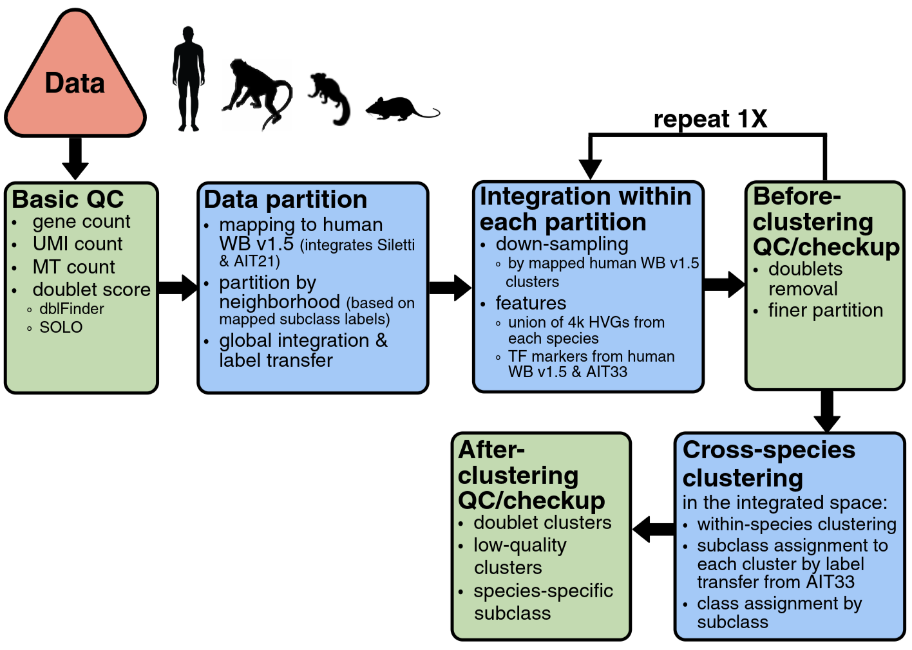

# Human and Mammalian Brain Atlas v0.5

<sub>BRAIN Initiative Cell Atlas Network (BICAN)</sub>


The **HMBA Whole-Brain (WB) Atlas** is a cross-species, whole-brain single-cell RNA-seq taxonomy. It covers **human, macaque, and marmoset**, using the **mouse and human whole-brain taxonomies** (Yao et al., Siletti et al.) as reference, and spans roughly **21 million cells**.

This page documents the **v0.5 data share**: what is delivered, how it is organized, and what every metadata column means.

> **Status:** v0.5 is a working release. Known gaps and planned fixes are tracked in [GitHub issues](https://github.com/AllenInstitute/HMBA_WB_Atlas/issues).

---

## Contents

- [At a glance](#at-a-glance)
- [Community annotation](#community-annotation)
- [Data release](#data-release)
  - [1. AIT taxonomy files](#1-ait-taxonomy-files)
  - [2. MapMyCells mapping files](#2-mapmycells-mapping-files)
- [Sampling overview](#sampling-overview)
- [Pipeline](#pipeline)
- [Metadata dictionary](#metadata-dictionary)
- [Contact](#contact)

---

## At a glance

| | |
|---|---|
| **Version** | v0.5 |
| **Species** | human, macaque, marmoset |
| **References** | mouse and human whole brain (Yao et al., Siletti et al.) |
| **Cells** | ~21 million |
| **Taxonomy hierarchy** | `neighborhood` → `class` → `subclass` → `cluster` |
| **Ortholog gene space** | 15,138 genes shared across human / macaque / marmoset / mouse |
| **Cluster ID format** | `{species}:{neighborhood}:{int}` |

---

## Community annotation

Annotating a taxonomy this large is a community effort, and two routes for engaging with it are in progress.

**ABC Atlas (BICAN).** The v0.5 data will be browsable through the ABC Atlas for BICAN, alongside the other BICAN taxonomies. *(Link to come.)*

**Taxonomy editing tool.** A taxonomy editing tool will be made available so annotators can propose and record changes to cluster, subclass, and class labels directly against the released taxonomy. *(Link to come.)*

In the meantime, feedback on cell type annotations is welcome; see [Contact](#contact).

---

## Data release

All v0.5 artifacts live under a single S3 prefix:

```
s3://<BUCKET>/<PREFIX>/HMBA_WB_Atlas/<RELEASE_DATE>/
```

> **Note:** the bucket and prefix above are placeholders. Contact the team (see [Contact](#contact)) for the resolved path and read access.

### 1. AIT taxonomy files

[AIT (Allen Institute Taxonomy)](https://github.com/AllenInstitute/AllenInstituteTaxonomy) is an AnnData-based container that bundles a taxonomy into a single self-describing file: the expression matrix, per-cell metadata, the full label hierarchy, and the latent spaces the clustering was built on all travel together. Anything you would normally have to reassemble from a matrix plus a handful of side-car tables is already joined and aligned, so one file is enough to browse the taxonomy, re-analyze it, or map new query data onto it.

Each species ships as **two files** containing the same cells in two gene spaces:

```
<species>_orthologs.<ext>    # 15,138-gene ortholog space, comparable across species
<species>_allGenes.<ext>     # species-native full gene set
```

Use the ortholog file for cross-species comparisons and the all-genes file when you need species-specific genes that have no one-to-one ortholog.

- `species` ∈ `{human, macaque, marmoset}`. **No AIT file is shipped for mouse.** The mouse and human whole-brain taxonomies (Yao et al., Siletti et al.) served as the references that these were mapped and aligned to.
- All neighborhoods for a species are contained in the same file; there is no per-neighborhood split.
- `obs` is identical across all files; see the [Metadata dictionary](#metadata-dictionary).
- `obsm` carries the **scVI latent representations** used for integration and clustering, along with the global 2D UMAP coordinates as `X_umap`. The UMAP was computed from projected scVI embeddings from the global integration.
- Cells flagged as junk during global or per-neighborhood integration have been removed.

> **Note:** exact filenames and container format are being finalized for the release.

### 2. MapMyCells mapping files

Reference assets for mapping new query data onto the HMBA WB taxonomy with [MapMyCells / cell_type_mapper](https://github.com/AllenInstitute/cell_type_mapper), provided per species.

> **Note:** the file manifest for this component is being finalized.

---

## Sampling overview


---

## Pipeline



The taxonomy is built by an iterative loop rather than a single pass. Clusters are proposed, stress-tested against QC and spatial evidence, and the partition is revised, repeating until the structure holds up.

**1. Basic QC.** Per-cell filtering on gene count, UMI count, and mitochondrial fraction, plus doublet scoring with both [dblFinder](https://bioconductor.org/packages/scDblFinder) and [SOLO](https://github.com/YosefLab/solo). Scores are retained on every cell rather than used only as a hard filter.

**2. Data partition.** Cells are mapped to the human WB v1.5 reference (which itself integrates Siletti and AIT21) and partitioned into neighborhoods using the mapped subclass labels. A global integration and label transfer runs across the full dataset to establish the initial cross-species frame.

**3. Integration within each neighborhood.** Each neighborhood is integrated separately, at a tractable scale:
   - **Down-sampling** by mapped human WB v1.5 cluster, capped at 400 cells per cluster, so abundant types don't dominate the embedding.
   - **Feature selection** from the union of 4k HVGs per species per neighborhood, augmented with neighborhood-level transcription-factor markers drawn from human WB v1.5 and AIT33.

**4. Cross-species clustering.** Within-species clustering runs in the shared integrated space using [`transcriptomic_clustering`](https://github.com/AllenInstitute/transcriptomic_clustering). Subclass and class labels are then assigned by transfer from AIT21. Clustering within species inside a common space is what makes clusters comparable across species without forcing them to merge.

**5. Post-clustering QC.** Clusters are flagged as doublet, low-quality, or species-specific. Nothing is silently dropped.

**6. Iterate.** If the QC pass surfaces problems, the neighborhood partition is revised and steps 2 through 5 rerun. Only once the partition is stable does the release move on.

**7. Spatial validation.** The atlas is developed in a tight loop with the HMBA spatial transcriptomics teams. Clusters showing diffuse or absent spatial patterns, either in the cluster itself or across its cross-species matches, are flagged, and their subclass/class assignments are refined against what the spatial data actually supports. This feedback is a first-class input to the taxonomy, not a downstream check.

**8. Joint cell type annotation.** The transcriptomic and spatial evidence are reconciled into the final annotation: within-species clusters with their QC flags, cross-species subclass and class labels, and cross-species cluster correspondence.

---

## Metadata dictionary

The `obs` schema is identical across the ortholog and full-gene-space files.

### Cell-type labels (HMBA WB taxonomy v0.5, final)

| Column | Description |
|---|---|
| `cluster` | Cluster ID, formatted `{species}:{neighborhood}:{int}` |
| `subclass` | Subclass label |
| `class` | Class label |
| `neighborhood` | Final neighborhood assignment used for clustering |

### Sample / donor identity

| Column | Description |
|---|---|
| `species` | `human` / `macaque` / `marmoset` |
| `donor` | Donor ID |
| `sample` | Library / 10X load ID |
| `sex` | Donor sex |
| `age` | Donor age |
| `study` | Source study the cell came from: `HMBA`, `Siletti`, `AIT21`, or `Macosko` |
| `chemistry` | 10X chemistry: `multiome` (HMBA), `snRNAseq` (Siletti), `10Xv2` / `10Xv3` (AIT21), `Macosko_snRNAseq` (Macosko) |

### Anatomical

| Column | Description |
|---|---|
| `brain region` | Coarse brain region |
| `roi` | Region of interest, finer than `brain region`. **Currently inaccurate for marmoset**; values should all be `brain` |

### QC metrics (continuous)

| Column | Description |
|---|---|
| `n_genes_by_counts` | Genes detected per cell |
| `total_counts` | Total UMI count per cell |
| `pct_counts_mt` | Mitochondrial read percentage |
| `doublet_score` | dblFinder doublet score |
| `solo_doublet_score` | solo doublet score |
| `tso_reads_fraction` | Fraction of reads containing the 10X TSO sequence (Optimus pipeline) |
| `reads_exonic_intronic_fraction` | Fraction of reads mapping to exons + introns (Optimus pipeline) |

---

## Contact

Questions, access requests, or issues with the data share: open an [issue](https://github.com/AllenInstitute/HMBA_WB_Atlas/issues) or reach out to the HMBA cross-species working group.

---

## Related tools

- [`AllenInstituteTaxonomy`](https://github.com/AllenInstitute/AllenInstituteTaxonomy): AIT taxonomy file format and utilities
- [`transcriptomic_clustering`](https://github.com/AllenInstitute/transcriptomic_clustering): large-scale clustering
- [`cell_type_mapper`](https://github.com/AllenInstitute/cell_type_mapper): MapMyCells reference mapping
