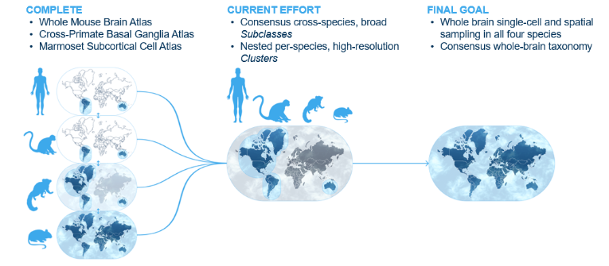
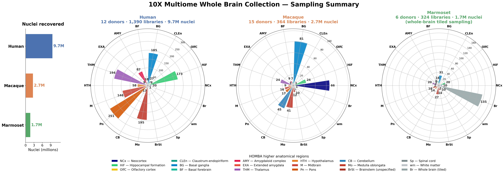
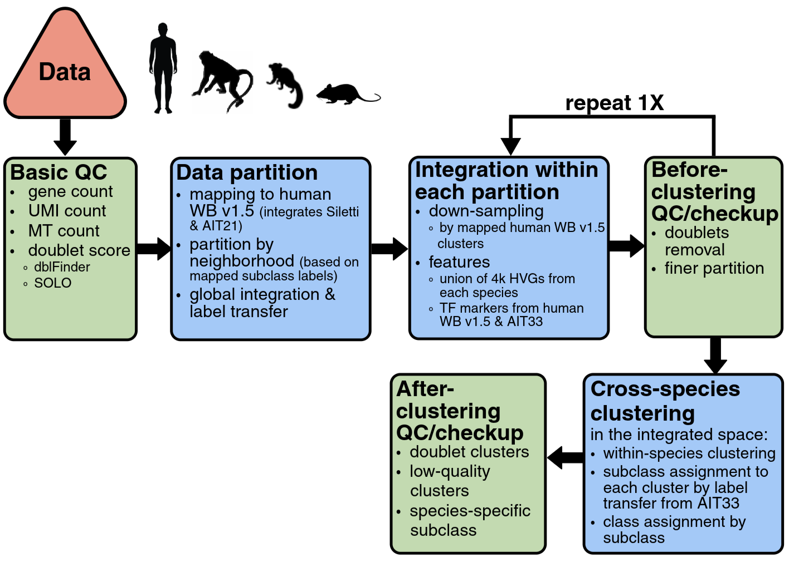

# Human and Mammalian Brain Atlas v0.5

<sub>BRAIN Initiative Cell Atlas Network (BICAN)</sub>



The **HMBA Whole-Brain (WB) Atlas** is a cross-species, whole-brain single-cell RNA-seq taxonomy. It covers **human, macaque, and marmoset**, using the **mouse and human whole-brain taxonomies** (Yao et al., Langlieb et al., Siletti et al.) as reference, and spans roughly **21 million cells**.

This page documents the **v0.5 data share**: what is delivered, how it is organized, and what every metadata column means.

> **Status:** v0.5 is a working release. Known gaps and planned fixes are tracked in [GitHub issues](https://github.com/AllenInstitute/HMBA_WB_Atlas/issues).

---

## Contents

- [At a glance](#at-a-glance)
- [Regional annotation working groups](#regional-annotation-working-groups)
- [Community annotation](#community-annotation)
- [Planned versions](#planned-versions)
- [Data release](#data-release)
  - [Downloading](#downloading)
  - [1. AIT taxonomy files](#1-ait-taxonomy-files)
  - [2. MapMyCells mapping files](#2-mapmycells-mapping-files)
- [Sampling overview](#sampling-overview)
- [Pipeline](#pipeline)
- [Metadata dictionary](#metadata-dictionary)
- [Contact](#contact)
- [Check-in agenda automation](#check-in-agenda-automation)

---

## Check-in agenda automation

The [draft workflow](.github/workflows/check-in-agenda.yml) updates root-level
[`email.md`](email.md) from [AllenInstitute Project #66](https://github.com/orgs/AllenInstitute/projects/66).
It **does not send email**, use Outlook, or need mail credentials. The draft is
addressed only to `nelson.johansen@alleninstitute.org`.

Selection is exactly **Status = `Check-In` AND linked content is an OPEN Issue**,
across all source repositories. Closed issues, pull requests, and drafts are
excluded. View #5's saved filters are not used; there is no target-date filter.
The generator validates a single-select field named exactly `Status` with an
option named exactly `Check-In`, and paginates fields, items, and assignees.
Selection is isolated in `qualifies()` for future target-date rules.

### Setup and public-repository safety

1. An organization administrator should provision a separate, least-privilege
   project-read credential as the Actions secret **`PROJECT_READ_TOKEN`**.
   A fine-grained PAT should use AllenInstitute as resource owner and
   **Organization permissions → Projects: Read-only**, with organization
   approval/SSO authorization as required. Grant only the issue read access
   needed to resolve linked content (Issues: Read-only on selected repositories
   when necessary). Alternatively supply a short-lived GitHub App installation
   token with organization Projects read and necessary source Issues read
   permissions; token issuance/renewal must be configured separately.
   Do not grant this credential project or repository write access.
2. The workflow's separate `GITHUB_TOKEN` has only `contents: write` in the draft
   job, solely for committing `email.md`. Enable Actions write permissions and
   ensure main's rules permit the bot to push. If rules require a PR, the push
   will fail visibly; do not weaken protection without administrator approval.
3. **This repository, `email.md`, its commit history, and Actions logs are public.**
   Any qualifying issue whose repository visibility is not positively `PUBLIC`
   blocks the entire generation. Any inaccessible/redacted issue item also
   blocks it, even if its Status cannot be read.
   No partial agenda is published and no issue metadata/API error payload is
   printed, including in dry-run mode. Ensure the reader can resolve **all**
   project issues: GitHub may hide resources outside its permissions entirely,
   so a restricted token cannot establish project completeness.
   Do not remove this safeguard to include private issues. For a full agenda
   containing private items, use a **private hosting repository**, authorized
   readers, and an explicitly reviewed private-output policy instead.
   Even public issue titles can contain sensitive material: review source
   content before enabling automation. On failure the previous draft remains
   unchanged and may be stale; check the workflow result before using it.

### Schedule, preview, and tests

Two Monday UTC schedules (16:00 and 17:00) are gated using Python's
`America/Los_Angeles` timezone: only the trigger corresponding to **9:00 AM
Pacific local time**, PST or PDT, generates a draft. Delays later that Monday
are accepted, not rejected for missing the exact minute; the other trigger is
skipped. Runs delayed past Monday are skipped. GitHub schedules are best-effort:
they can be delayed or dropped, execute only on the default branch (`main`),
and can be disabled after 60 days of inactivity in public repositories.
This is not a guaranteed 9:00 AM delivery service; dispatch manually if a run
is missed. The meeting date is the LA run date, with no changing timestamp;
identical content causes no commit.

After merging, use **Actions → Check-in agenda draft → Run workflow**, on
`main`, leaving **dry_run** enabled initially. This validates and writes the
draft only in the ephemeral runner workspace: no commit, artifact, or agenda
content in public logs. For an actual preview, run
`python3 scripts/check_in_agenda.py --dry-run` in a trusted local checkout with
`PROJECT_READ_TOKEN` supplied through the environment, then inspect `email.md`
locally. Do not paste tokens into commands or enable shell tracing. Dry-run
still enforces the public-source rule. Uncheck dry_run to commit a validated
draft; subsequent scheduled runs also commit. Dispatch on other branches is
disabled so project credentials are not handed to unreviewed branch code.

Tests use only Python's standard library (Python 3.9+ with system timezone
data): `python3 -m unittest discover -s tests -v`. PR tests use synthetic data,
no project credentials, and do not generate a real agenda. API retries are
bounded, honor rate-limit headers, and fail rather than publish partial data.

## At a glance

| | |
|---|---|
| **Version** | v0.5 |
| **Species** | human, macaque, marmoset |
| **References** | mouse and human whole brain (Yao et al., Langlieb et al., Siletti et al.) |
| **Cells** | ~21 million |
| **Taxonomy hierarchy** | `neighborhood` → `class` → `subclass` → `cluster` |
| **Ortholog gene space** | 15,138 genes shared across human / macaque / marmoset / mouse |
| **Cluster ID format** | `{species}:{neighborhood}:{int}` |

---

## Regional annotation working groups

Annotation is organized into working groups, each responsible for one brain region or cross-cutting slice of the taxonomy. Groups review the cell types in their region across all species, reconcile them against the reference taxonomies and the spatial data, and settle the subclass and class labels that ship. Questions about a specific region are best directed to its leads.

| Region | Lead(s) |
|---|---|
| Neocortex | Rebecca Hodge |
| Medial temporal lobe | Aaron Garcia, Yuanyuan Fu |
| Basal ganglia | Nelson Johansen, Yuanyuan Fu |
| Thalamus | Brian Long, Meghan Turner |
| Hypothalamus | Fenna Krienen, Stephanie Seeman |
| Midbrain, Medulla, Pons | Dan Yuan, Zizhen Yao, Cindy van Velthoven, Hongkui Zeng |
| Cerebellum | Rebecca Hodge |
| Spinal cord | Matthew Schmitz, Nelson Johansen |
| Non-neuronal WB | Yuanyuan Fu |
| Cross-species WB | Zizhen Yao, Trygve Bakken |

To request membership in a working group, contact Lauren Kruse (<lauren.kruse@alleninstitute.org>).

---

## Community annotation

Annotating a taxonomy this large is a community effort. Two routes are in progress, and both will be made available to the [regional annotation working groups](#regional-annotation-working-groups).

**ABC Atlas.** The v0.5 data will be browsable through the ABC Atlas. *(Link to come.)*

**Taxonomy editing tool.** A taxonomy editing tool will be made available so annotators can propose and record changes to cluster, subclass, and class labels directly against the released taxonomy. *(Link to come.)*

In the meantime, feedback on cell type annotations is welcome; see [Contact](#contact).

---

## Planned versions

v0.5 is the current release. Dates are targets, not commitments.

| Version | Target | Access | Focus |
|---|---|---|---|
| v1.0 | December 2026 | BICAN | Regional working group feedback, improved spatial mapping, cross-species subclass alignment |
| v2.0 | Q2 2027 | Public | New data pull adding donors across species; delivered through ABC Atlas, MapMyCells, and brain-map |
| v3.0 | TBD | Public | Complete cortical and subcortical sampling in all species |

---

## Data release

All v0.5 artifacts live under a single S3 prefix:

```
s3://released-taxonomies-802451596237-us-west-2/HMBA/whole_brain/0.5/
```

One subfolder per species, each holding that species' AIT taxonomy file and its MapMyCells assets:

```
0.5/
├── human/       AIT file + MapMyCells files
├── macaque/     AIT file + MapMyCells files
└── marmoset/    AIT file + MapMyCells files
```

### Downloading

The bucket allows anonymous reads, so no AWS account or credentials are needed. You do need the [AWS CLI](https://docs.aws.amazon.com/cli/latest/userguide/getting-started-install.html), and every command needs both `--no-sign-request` and `--region us-west-2`.

See what is available, with sizes:

```bash
aws s3 ls s3://released-taxonomies-802451596237-us-west-2/HMBA/whole_brain/0.5/ --no-sign-request --region us-west-2 --recursive --human-readable
```

Download everything for one species:

```bash
aws s3 sync s3://released-taxonomies-802451596237-us-west-2/HMBA/whole_brain/0.5/human/ ./human/ --no-sign-request --region us-west-2
```

Download a single file:

```bash
aws s3 cp s3://released-taxonomies-802451596237-us-west-2/HMBA/whole_brain/0.5/human/<filename> . --no-sign-request --region us-west-2
```

> **Check your disk space first.** Individual files run to several GB, and the MapMyCells reference markers are roughly 8 GB per species. `aws s3 sync` is resumable, so an interrupted transfer can be restarted with the same command and will skip what already arrived.

### 1. AIT taxonomy files

[AIT (Allen Institute Taxonomy)](https://github.com/AllenInstitute/AllenInstituteTaxonomy) is an AnnData-based container that bundles a taxonomy into a single self-describing file: the expression matrix, per-cell metadata, the full label hierarchy, and the latent spaces the clustering was built on all travel together. Anything you would normally have to reassemble from a matrix plus a handful of side-car tables is already joined and aligned, so one file is enough to browse the taxonomy, re-analyze it, or map new query data onto it.

**One AIT file per species**, carrying both gene spaces: the species-native full gene set and the 15,138-gene ortholog space shared across species. Use the ortholog space for cross-species comparisons, and the full gene set when you need species-specific genes that have no one-to-one ortholog.

- `species` ∈ `{human, macaque, marmoset}`. **No AIT file is shipped for mouse.** The mouse and human whole-brain taxonomies (Yao et al., Langlieb et al., Siletti et al.) served as the references that these were mapped and aligned to.
- All neighborhoods for a species are contained in the same file; there is no per-neighborhood split.
- `obs` holds the per-cell metadata; see the [Metadata dictionary](#metadata-dictionary).
- `obsm` carries the **scVI latent representations** used for integration and clustering, along with the global 2D UMAP coordinates as `X_umap`. The UMAP was computed from projected scVI embeddings from the global integration.
- Cells flagged as junk during global or per-neighborhood integration have been removed.

### 2. MapMyCells mapping files

Reference assets for mapping new query data onto the HMBA WB taxonomy with [MapMyCells / cell_type_mapper](https://github.com/AllenInstitute/cell_type_mapper), provided per species alongside the AIT file.

---

## Sampling overview



Sampling concentrates on **subcortical structures** in human, macaque, and marmoset. Neocortex is already covered in depth by earlier atlases, so this collection goes deep on the subcortex instead: basal ganglia, thalamus, hypothalamus, amygdala and extended amygdala, hippocampal formation, claustrum-endopiriform, midbrain, pons, medulla, and cerebellum. Marmoset was collected as whole-brain tiled sampling rather than dissected region by region.

| Species | Donors | Libraries | Nuclei |
|---|---|---|---|
| Human | 12 | 1,390 | 9.7M |
| Macaque | 15 | 364 | 2.7M |
| Marmoset | 6 | 324 | 1.7M |

The polar plots break sampling down by HOMBA higher anatomical region, so wedge length reflects sampling effort rather than cell yield. These counts cover the nuclei newly generated for HMBA by 10X Multiome; the taxonomy also incorporates cells from the external studies listed under `study` in the [Metadata dictionary](#metadata-dictionary).

---

## Pipeline



The taxonomy is built by an iterative loop rather than a single pass. Clusters are proposed, stress-tested against QC and spatial evidence, and the partition is revised, repeating until the structure holds up.

**1. Basic QC.** Per-cell filtering on gene count, UMI count, and mitochondrial fraction, plus doublet scoring with both [dblFinder](https://bioconductor.org/packages/scDblFinder) and [SOLO](https://github.com/YosefLab/solo). Scores are retained on every cell rather than used only as a hard filter.

**2. Data partition.** Cells are mapped to the human WB v1.5 reference (which itself integrates Siletti and AIT21) and partitioned into neighborhoods using the mapped subclass labels. A global integration and label transfer runs across the full dataset to establish the initial cross-species frame.

**3. Integration within each neighborhood.** Each neighborhood is integrated separately, at a tractable scale:
   - **Down-sampling** by mapped human WB v1.5 cluster, capped at 400 cells per cluster, so abundant types don't dominate the embedding.
   - **Feature selection** from the union of 4k HVGs per species per neighborhood, augmented with neighborhood-level transcription-factor markers drawn from human WB v1.5 and AIT33.

**4. Cross-species clustering.** Within-species clustering runs in the shared integrated space using [`transcriptomic_clustering`](https://github.com/AllenInstitute/transcriptomic_clustering). Subclass and class labels are then assigned by transfer from AIT33. Clustering within species inside a common space is what makes clusters comparable across species without forcing them to merge.

**5. Post-clustering QC.** Clusters are flagged as doublet, low-quality, or species-specific. Nothing is silently dropped.

**6. Iterate.** If the QC pass surfaces problems, the neighborhood partition is revised and steps 2 through 5 rerun. Only once the partition is stable does the release move on.

**7. Spatial validation.** The atlas is developed in a tight loop with the HMBA spatial transcriptomics teams. Clusters showing diffuse or absent spatial patterns, either in the cluster itself or across its cross-species matches, are flagged, and their subclass/class assignments are refined against what the spatial data actually supports. This feedback is a first-class input to the taxonomy, not a downstream check.

**8. Joint cell type annotation.** The transcriptomic and spatial evidence are reconciled into the final annotation: within-species clusters with their QC flags, cross-species subclass and class labels, and cross-species cluster correspondence.

---

## Metadata dictionary

The `obs` schema is identical across the ortholog and full-gene-space files.

### Cell-type labels (HMBA WB taxonomy v0.5, final)

| Column | Description |
|---|---|
| `cluster` | Cluster ID, formatted `{species}:{neighborhood}:{int}` |
| `subclass` | Subclass label |
| `class` | Class label |
| `neighborhood` | Final neighborhood assignment used for clustering |

### Sample / donor identity

| Column | Description |
|---|---|
| `species` | `human` / `macaque` / `marmoset` |
| `donor` | Donor ID |
| `sample` | Library / 10X load ID |
| `sex` | Donor sex |
| `age` | Donor age |
| `study` | Source study the cell came from: `HMBA`, `Siletti`, `AIT21`, or `Macosko` |
| `chemistry` | 10X chemistry: `multiome` (HMBA), `snRNAseq` (Siletti), `10Xv2` / `10Xv3` (AIT21), `Macosko_snRNAseq` (Macosko) |

### Anatomical

| Column | Description |
|---|---|
| `brain region` | Coarse brain region |
| `roi` | Region of interest, finer than `brain region`. **Currently inaccurate for marmoset**; values should all be `brain` |

### QC metrics (continuous)

| Column | Description |
|---|---|
| `n_genes_by_counts` | Genes detected per cell |
| `total_counts` | Total UMI count per cell |
| `pct_counts_mt` | Mitochondrial read percentage |
| `doublet_score` | dblFinder doublet score |
| `solo_doublet_score` | solo doublet score |
| `tso_reads_fraction` | Fraction of reads containing the 10X TSO sequence (Optimus pipeline) |
| `reads_exonic_intronic_fraction` | Fraction of reads mapping to exons + introns (Optimus pipeline) |

---

## Contact

Questions, access requests, or issues with the data share: open an [issue](https://github.com/AllenInstitute/HMBA_WB_Atlas/issues) or reach out to the HMBA cross-species working group.

---

## Related tools

- [`AllenInstituteTaxonomy`](https://github.com/AllenInstitute/AllenInstituteTaxonomy): AIT taxonomy file format and utilities
- [`transcriptomic_clustering`](https://github.com/AllenInstitute/transcriptomic_clustering): large-scale clustering
- [`cell_type_mapper`](https://github.com/AllenInstitute/cell_type_mapper): MapMyCells reference mapping
